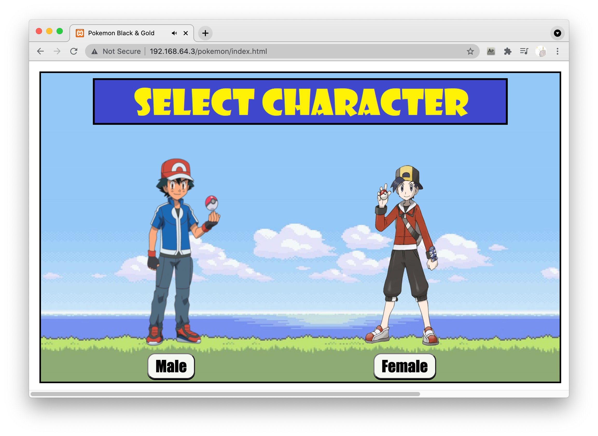
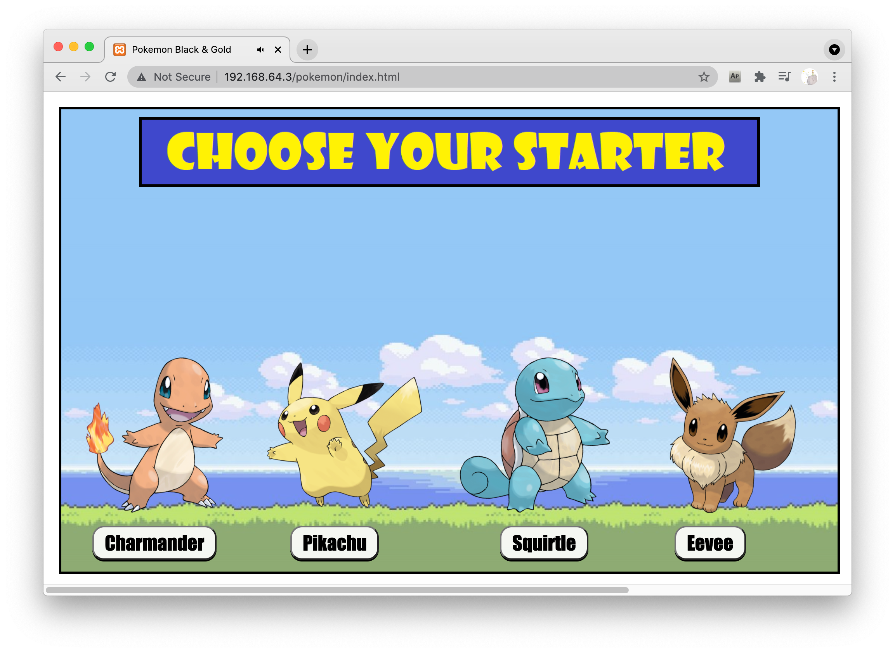
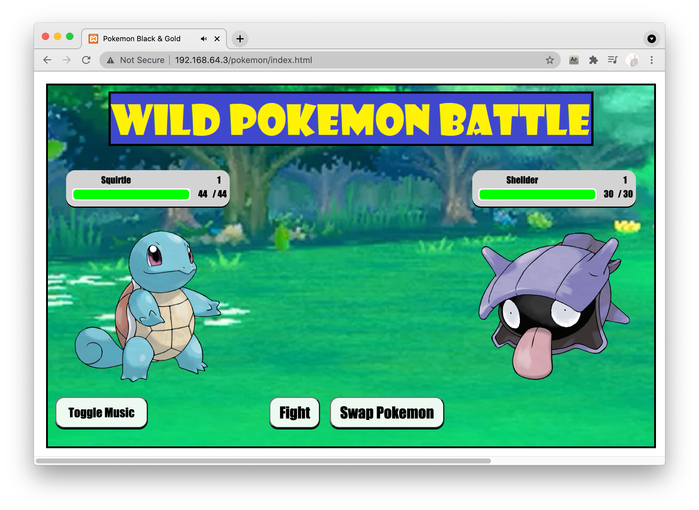
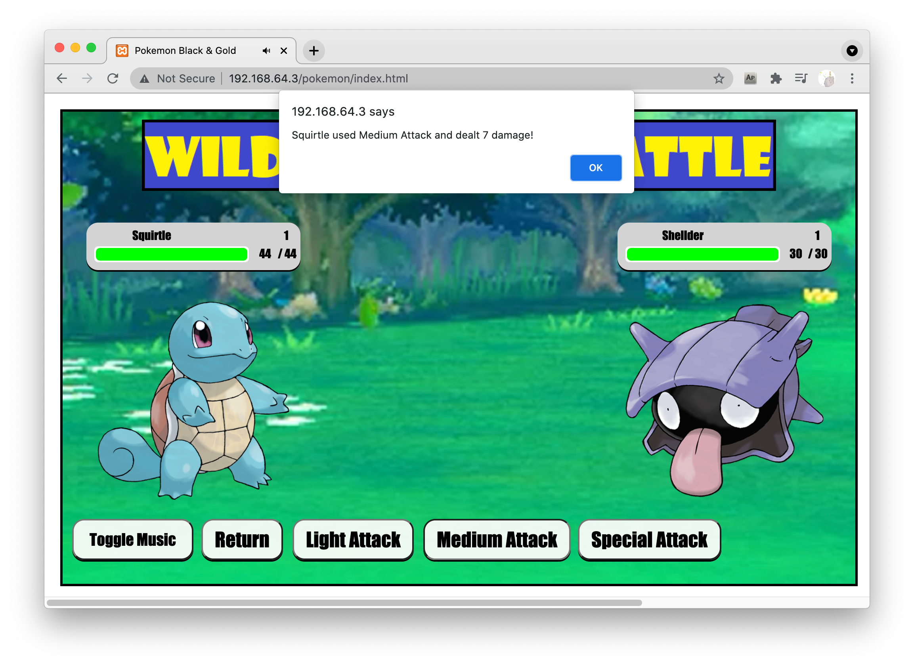
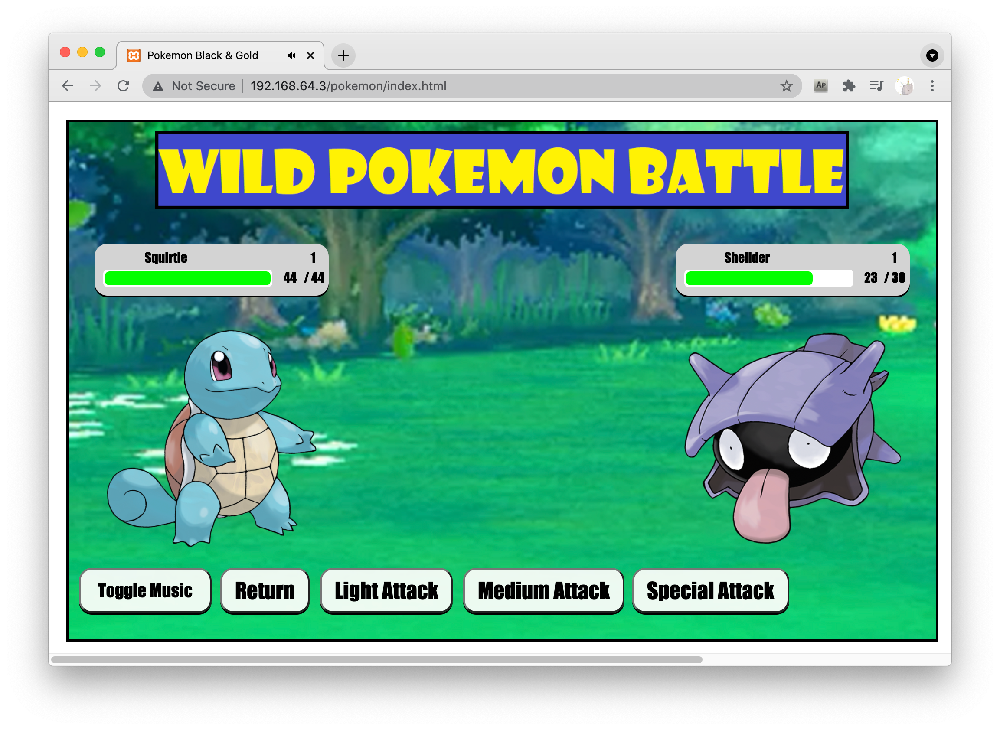
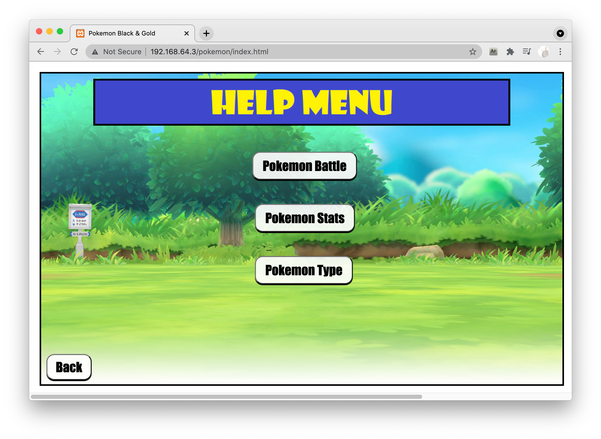
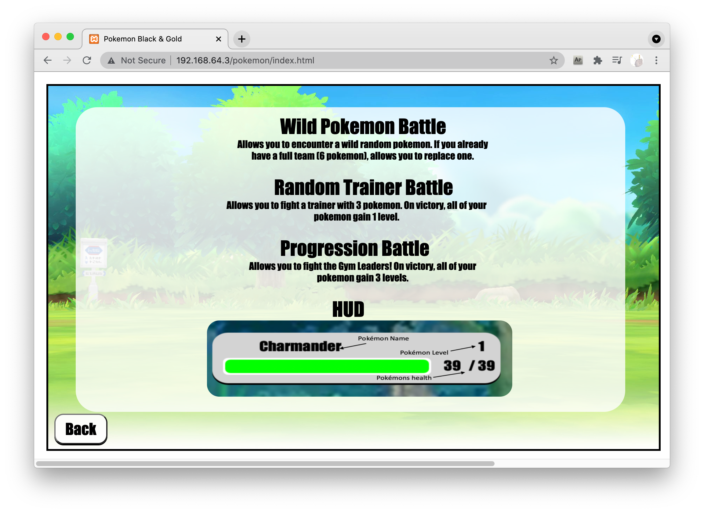
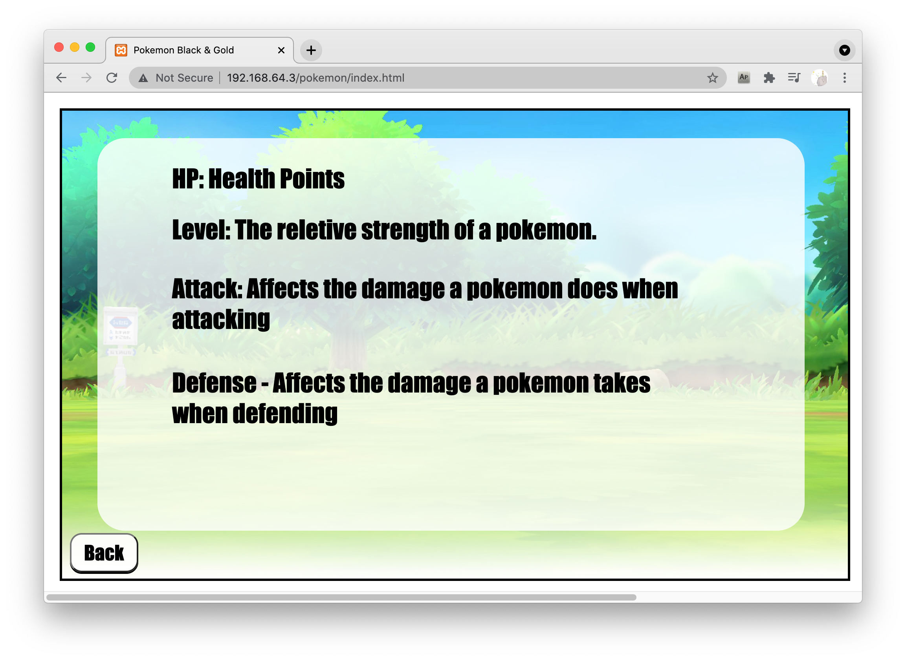
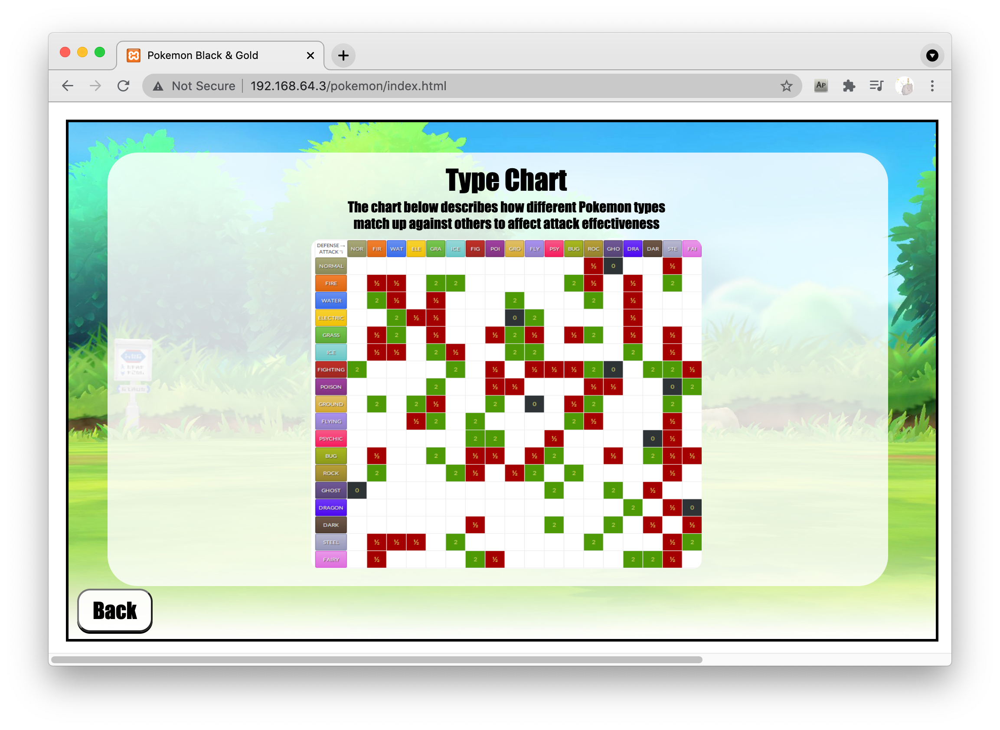
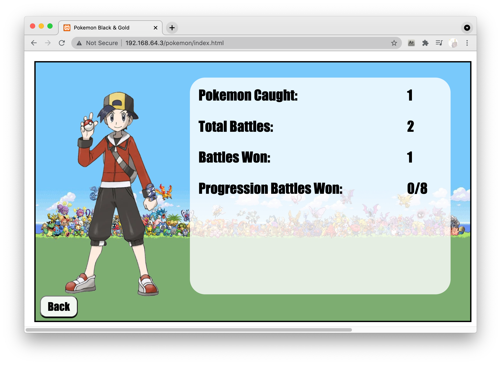

# pokemon_web_game

# Features Introduction

This is a web based pokemon game. Gamers can capture, train pokemon sprites and fight against other polemon sprites.

After the start page gamer is asked to character (Male or Female) and starting sprites. 

Then you can fight with other sprites. There are three levels of battles you can choose from: 

- Wild Pokemon Battle
  - Loads a single random pokemon
  - Ends with the ability to catch the pokemon
- Random Trainer Battle
  - Loads 3 random pokemon into an array
  - At the end of the battle, increases the level of all pokemon in the user’s party by 1 level
- Progression Battle
  - Loads pokemon into the trainer array from a constant
  - On success, increases the level of all pokemon in the user’s party by 3 levels

  

Click any battle will bring you to the battle page. Both you and your opponent will be shown with their status. Gamers can swap polemons anytime during the battle.

Gamer can launch three types of attacks: Light Attack, Medium Attack, Special Attack. Each sprites has different ability to attack and brings different harm to opponent. You and your opponent will attack in turns. Pokemon with higher speed stat attacks first. Damage calculated based on type advantage and pokemon’s attack, defense, and level. 

After click the attack button the detail information of this attack and result will be shown in windows. 

The "Help" button brings you to  the help page which shows some introduction and explanation  of this game, helping you to master it.

The "Users stats" button brings users to their profile page which shows the summary of  their battle results. 

# Technology Introduction

|Section|Tech used|
|-|-|
|Server|Apache inside XAMPP|
|Backend Development Language|PHP|
|Frontend Development Language|HTML, CSS, JavaScript|
|Database|MariaDB (similar to MySQL)|
||

##  Database
- 2 tables to store data
  - Characters table
  - User table
- database.php to establish database connection
- Pokemon object for each table
  - Variables for fields
  - Functions for queries
- API endpoints
  - JSON objects
  - Query string parameters for search
    - Ex: name or ID

## Battle 
- Loading pokemon into a fight scene
  - Utilises a series of AJAX XMLHttpRequests
  - Uses PHP API calls from backend to connect to the database
  - Caches imported pokemon into objects for easy access to stats
  - User’s pokemon stored in array for quick swapping mid-battle
- Battle Mechanics
  - Turn based 
  - Pokemon with higher speed stat attacks first
  - Damage calculated based on type advantage and pokemon’s attack, defense, and level

## Directory explanation
- All PHP files:
  - holds all API files.
- source/php/characters:
  - holds all files that relate to the characters table in the database (this is where all pokemon and default values are stored)
- source/php/user:
  - holds all files that relate to the user table in the database (this is where user's owned pokemon values are stored)
- source/Images:
  - leave images where they are, the paths are stored in the database.

# [How to run it? Check out steps here.](doc/steps2run.md)

# Important Notice for Registered Students:

If your assignment/project is similar to this repo, this would be a good learning resources for you. One suggest is you go through this repo then close it when you write your own solution, and reference it correctly. 
    
You are highly recommended to check your university/department/professor's rules about referring to internet resources. If there isn't a specific rule, you are highly recommended to ask your professor to elaborate it. Do they have open-internet policy? Do they ask for listing references at the end of your report only, or indicating exactly which parts/blocks of your code re-use which references? Do they require the re-used code from internet sources cannot exceed a specific percentage of your whole submission?
    
If your submisssion was similar with anyone else's, this would be a very bad situation in almost all universties. You should definitely avoid this.        

