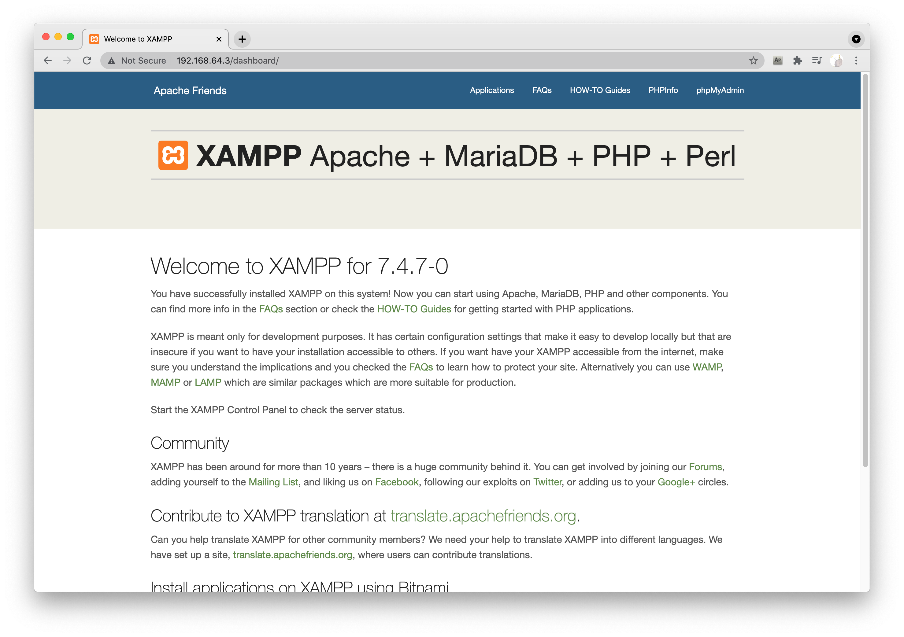

# Step 1: install XAMPP

This app uses XAMPP as server. XAMPP is a completel Apache distribution containing MariaDB, PHP, and Perl. Please download it from its [official website](https://www.apachefriends.org/index.html) and install it.

After finishing installment, start it and make sure it runs. It looks like this:


Click the "Go to Application" button, it will open its start html page, it looks like this:



If you can also get above three screenshots on your Mac or PC then it implies that you installed XAMPP successfully and you are good to continue.

# Step 2: Set up the database.

Before we run our application we must setup the database we used. We use the MariaDB in XAMPP which is very very similar to MySQL.

Click the "phpMyAdmin" button on the top right of XAMPP start page, then you go to the database management page. 


Run those SQL following the steps in the file "source/setup.sql". 

Firstly, create the database called "pokemon" and then use it. 
```sql
CREATE DATABASE pokemon;
use pokemon;
```

Secondly, grant privledges and modify the account info in "source/php/database.php" file.


Thirdly and fourthly, just run those SQL.

# Step 3: Copy source code into XAMPP.
  
In XAMPP click the "Volumes -- Mount" button. Then click the "Explore" button, it will open the Finder/Folder or something. It looks like this:


Then go the directory "htdocs", under it, create a directory called "pokemon". Copy all files inside "source" directory in this repo into the new created "htdocs/pokemon" directory. Looks like this:


# Step 4: Enjoy this game!

Then open http://localhost/pokemon/index.html or http://Your_local_ip_address/pokemon/index.html or other corresponding address in your browser, enjoy the game!


# Possible issues:
- If this application can not be shown correctly 
  - Make sure all files has enough permissions. All files should have at least "r" permission, don't forget files inside "Music" and "Images" directories.
  - All files inside "php"  should have at least "r" and "x" permisson.


